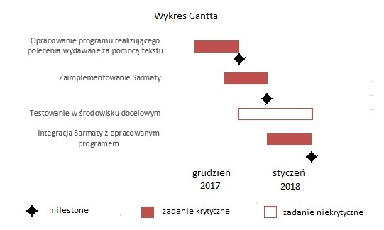

<b>Tytuł: Interfejs-głosowy</b>

<b>Temat: Interfejs pozwalający na dostęp do plików i folderów oraz poruszaniu się w nich, tylko przy użyciu komend głosowych w środowisku android.</b>

<b>Spis treści:</b>  
I. Wstępna koncepcja/Zasada działania  
II. Etapy projektu  
III. Wykres Gantta  
IV. Deliverables  
V. SWOT  
VI. Technika pracy w zespole  
VII. Informacje organizacyjne  

<b>I. Wstępna koncepcja/Zasada działania: </b>  
Ten punkt może się lekko zmienić w trakcie realizowania projektu.

Nasza aplikacja będzie działać w tle w trybie uśpionym i oczekiwać na słowo kluczowe, które aktywują oprogramowanie do dalszego działania lub program aktywowany będzie przyciskiem.
Komenda głosowa zostanie wstępnie nagrana lub bezpośrednio przekazana do oprogramowania “Sarmata”, którego zadaniem będzie zwrócenie tej samej komendy w formie tekstu.
Tekst zostanie przekazany do właściwej części aplikacji która na jego podstawie ma wykonać jakąś czynność.

Przykładowo, zdanie “Sarmata, otwórz plik kalkulator.” zostanie rozbite i poszczególne jego składowe będą zinterpretowane przez oprogramowanie w następujący sposób:

“Saramata” - wprowadza program w stan “nasłuchiwania”;
“otwórz plik” - jedna z funkcji aktywnych posiadanych przez aplikację;
“kalkulator” - nazwa danego pliku na który ma zadziałać wypowiedziana wcześniej funkcja.

Program będzie miał prawdopodobnie formę drzewka, gdzie trzeba będzie wypowiadać komendy w określonej kolejności (Sarmata->otwórz plik->kalkulator), z każdą kolejną dodaną funkcją pojawiać się będą nowe rozgałęzienia. 

Kod będzie pisany w taki sposób, aby łatwo można było dodawać kolejne funkcje.

<b>II. Etapy projektu</b>
1. Opracowanie programu realizującego polecenia wydawane za pomocą tekstu,  
2. Zaimplementowanie Sarmaty,  
3. Integracja Sarmaty z opracowanym programem,  
4. Testowanie w środowisku docelowym (na bieżąco).   
  
<b>III. Wykres Gantta:</b>  
 
  
<b>IV. Deliverables:</b>  
1. Dokumentacja.  
2. Aplikacja w wersji 0.5 gdzie tekst będzie wpisywany wyłącznie ręcznie, “Sarmata” nie będzie jeszcze potrzebny.  
3. W pełni sprawna aplikacja (wersja 1.0), gdzie sterowanie będzie odbywać się jedynie przy pomocy mowy.  
4. Prezentacja/Opis działania.  

<b>V. SWOT:</b>  
Strengths:  
•	znajomość wielu języków programowania(Assembly,C,C++,C#,Java)  
•	znajomość platformy, na którą przygotowujemy projekt(Android)  
•	znajomość oraz umiejętność obsługi niezbędnych programów do wykonania zadania  

Weaknesses:  
•	pierwsza styczność z Sarmatą  
•	tworzenie aplikacji typu RunInBackground  

Opportunities:  
•	możliwość rozwoju aplikacji w sensie kontentu  
•	możliwość rozwoju aplikacji na inne platformy  

Threats:  
•	problem z serwerami Sarmaty  
•	brak czasu  
•	problemy implementacyjne  
   
<b>VI. Technika pracy w zespole:</b>  
Przyjęliśmy wzór techniki demokratycznej. Opiera się ona na założeniu, że w każdej kwestii głos każdego z uczestników projektu się liczy. Pozwoli to na prowadzenie projektu w sposób zorganizowany, ponieważ każdy kolejny etap będzie przedyskutowany, co pozwoli na znalezienie zawsze najlepszego rozwiązania. 

Problemem są sytuację, gdy przynajmniej jedna osoba upiera się przy swoim zdaniu, ale ustaliliśmy, że wtedy zagramy w marynarza.

<b>VII. Informacje organizacyjne:</b>  
Link do strony projektu: https://github.com/DL-Projekt  

Data: 1.12.2017  

